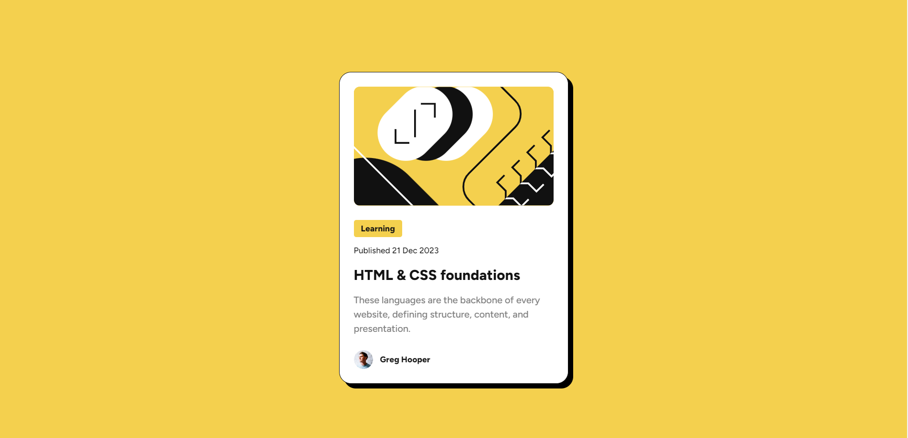
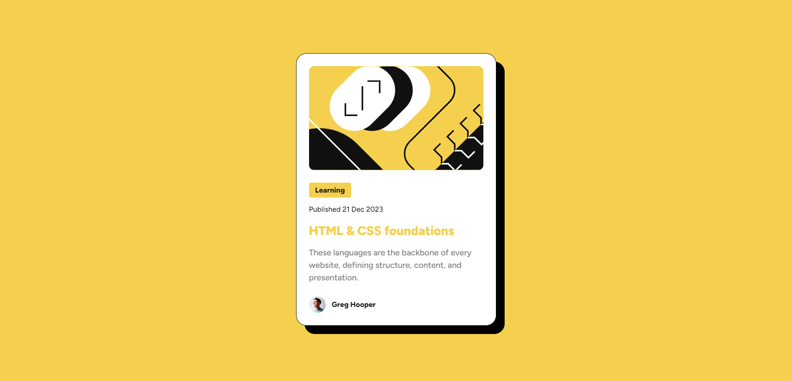
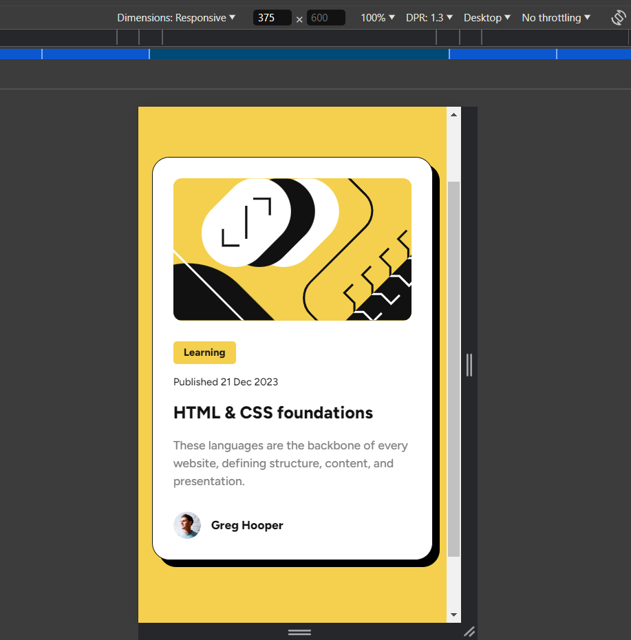

# Frontend Mentor - Blog preview card solution

This is my solution to the [Blog preview card challenge on Frontend Mentor](https://www.frontendmentor.io/challenges/blog-preview-card-ckPaj01IcS). Frontend Mentor challenges help you improve your coding skills by building realistic projects.

## Table of contents

- [Overview](#overview)
  - [The challenge](#the-challenge)
  - [Screenshot](#screenshot)
  - [Links](#links)
- [My process](#my-process)
  - [Built with](#built-with)

## Overview

I have been doing frontendmentor challenges without the design files and this was the first time I used design files to complete a challenge. Using desing files helps speed up the developing process by a lot.

### The challenge

Users should be able to:

- See hover and focus states for all interactive elements on the page

### Screenshot

### Links

- Solution URL: [GitHub Repo](https://github.com/huz3y/blog-preview-card-main.git)
- Live Site URL: [live site URL](https://blog-preview-card-main-omega-opal.vercel.app)

## My process

### Built with

- Semantic HTML5 markup
- CSS custom properties
- Sass (SCSS)
- Flexbox
- Desktop-first workflow
